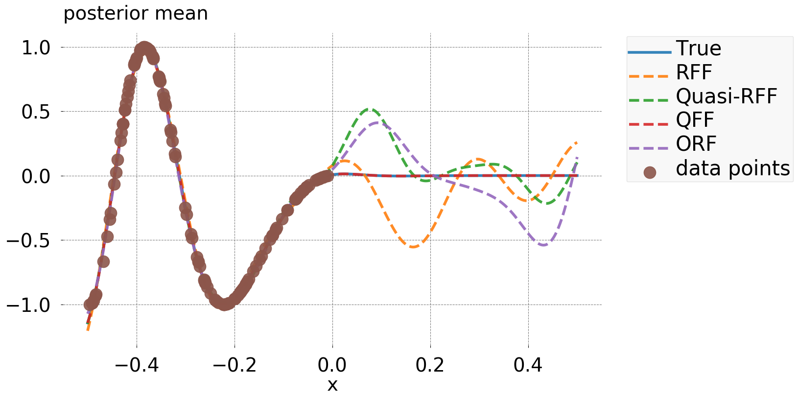

## Installation
First clone the repository:

`git clone https://github.com/Mojusko/QFF.git`

Inside the project directory, run

`pip install -e .`

The `-e` option installs the package in "editable" mode, where pip links to your local copy of the repository, instead of copying the files to the your site-packages directory. That way, a simple `git pull` will update the package.
The project requires Python 3.6, and the dependencies should be installed with the package.

## Updates
21/12/2019 - More efficient basis 

## Usage - Implements Phi(x) 
from embedding import *
x = torch.random(100,1) ## 100 random points in 1D
emb = HermiteEmbedding(gamma=0.5, m=100, d=1, groups=None, approx = "hermite") # Squared exponential with lenghtscale 0.5 with 100 basis functions 
Phi = emb.embed(x)

## Demonstration

RFF of Rahimi & Recht (2007)
Quasi-RFF Avron et. al. (2014) 
Orthogonal RFF - Felix et. al. (2016)
QFF - Mutny & Krause (2018)

